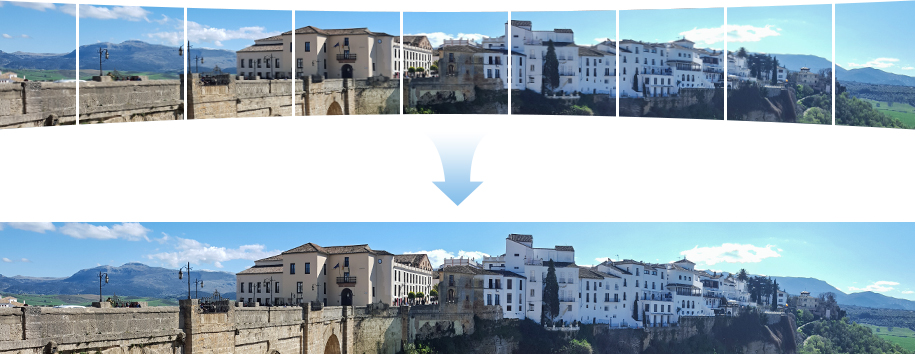

# Real-Time Image Stitching
CS205 Computing Foundations for Computational Science Final Project

Harvard University, 2018 Spring

Team members: Weihang Zhang, Xuefeng Peng, Jiacheng Shi, Ziqi Guo

**This page only provides technical documentations about the project. For a complete view of our project including motivation, design approach, results and analysis, please head over to the [project website](https://cs205-stitching.github.io).** 


## Project Goal

**Image stitching** or photo stitching is the process of combining multiple photographic images with overlapping fields of view to produce a segmented panorama or high-resolution image (example below).



(source: http://www.arcsoft.com/technology/stitching.html)

In this project, we want to use big compute techniques to parallelize the algorithms of image stitching, so that we can stream videos from adjacent camera into a single panoramic view.


## Instructions


### Compile Dependencies:

#### <TODO>

### Compile:

*cd* to one of the **surf_sequential/**, **surf_omp/**, or **surf_openacc/** folders before compile your code.

#### MacOS: 
``g++-7 -std=c++11 -fpermissive -o test main.cpp fasthessian.cpp integral.cpp ipoint.cpp surf.cpp utils.cpp `pkg-config opencv --cflags --libs```

#### Ubuntu: 

** Sequential & Open MP **

``g++ -std=c++11 -fpermissive -o test main.cpp fasthessian.cpp integral.cpp ipoint.cpp surf.cpp utils.cpp `pkg-config opencv --cflags --libs```

** OpenACC **

To compile without GPU: 

``g++ -std=c++11 -fpermissive -pthread -O3 -o test main.cpp fasthessian.cpp integral.cpp ipoint.cpp surf.cpp utils.cpp `pkg-config opencv --cflags --libs```

On machine with GTX GPU, compile with: 

``pgc++ -acc -ta=tesla:cc60 -Minfo -std=c++11 -O3 -o test main.cpp fasthessian.cpp integral.cpp ipoint.cpp surf.cpp utils.cpp `pkg-config opencv --cflags --libs```

On machine with Tesla GPU, compile with: 

``pgc++ -acc -ta=tesla:managed -Minfo -std=c++11 -O3 -o test main.cpp fasthessian.cpp integral.cpp ipoint.cpp surf.cpp utils.cpp `pkg-config opencv --cflags --libs```


### Run Test Cases:

#### <TODO>

### Run:

``./test -m <mode> [...]``

**Argument Options** (< > after flag indicates argument is required)

- -m | --mode < >: 

	- 0: run SURF on a single image
	- 1: run static image match between a pair of images
	- 2: run image stitching with webcam stream
        - 3: run image stitching with local video files

- -b | --blend_mode: (no additional argument)
         
	- if set, run blending algorithm with stitching; otherwise, run regular stitching algorithm

- -r | --resolution < >:

	- user-specified resolution

- -s | --single\_mem\_cpy: (OpenACC only)

	- if set, one single mem copy; otherwise, do memory copy from host to device every response layer

- -t | --threaded: (OpenACC only)

	- if set, one single mem copy; otherwise, do memory copy from host to device every response layer

- -S/L/R | --src/src1/src2 <path>
         
	- <path> path of  image/video to be processed. For mode 0, `-S|--src` will be used for single image feature extraction; for mode 1 and mode 3, `-LR|--src1 --src2` will be used for image/video stitching from local files
	- if flags are not set, will use sample image/video given by this repository


## References

- SURF code source: https://github.com/julapy/ofxOpenSurf
- Data source: videos taken from [Logitech webcams](https://www.amazon.com/Logitech-Laptop-Webcam-Design-360-Degree/dp/B004YW7WCY/ref=sr_1_8?s=pc&ie=UTF8&qid=1525394553&sr=1-8&keywords=logitech+webcam)
- Knowledge references:
  - Image stitching overview: http://ppwwyyxx.com/2016/How-to-Write-a-Panorama-Stitcher/
  - Keypoint detection: [Speed-Up Robust Features (SURF)](http://www.vision.ee.ethz.ch/~surf/eccv06.pdf)
  - Transformation estimation: [Random Sample Consensus (RANSAC)](http://www.cse.yorku.ca/~kosta/CompVis_Notes/ransac.pdf)
  - Perspective warping: https://github.com/stheakanath/panorama
  - Blending: Multi-band Blending: [A Multiresolution Spline With Application to Image Mosaics](http://persci.mit.edu/pub_pdfs/spline83.pdf)